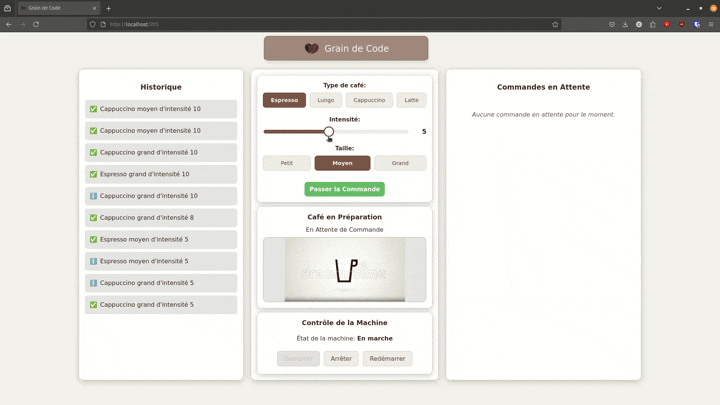

# Machine à Café Connectée - Projet Full-Stack

## Résumé des Technologies

*   **Backend**: PHP (Symfony), Architecture Hexagonale, RabbitMQ, Mercure, PostgreSQL, GraphQL, REST, Redis
*   **Frontend**: JavaScript (React), Vite
*   **Orchestration**: Docker, Docker Compose

## Documentation Détaillée

Pour une explication approfondie des choix d'architecture et du fonctionnement interne du projet, veuillez consulter :

*   [**Choix d'Architecture (`ChoixArchi.md`)**](./ChoixArchi.md): Détaille l'architecture backend (Hexagonale, API, RabbitMQ, Mercure, Worker) et frontend (React, Vite, communication).
*   [**Fonctionnement Détaillé (`Fonctionnement.md`)**](./Fonctionnement.md): Explique le flux des commandes, la gestion du worker, les annulations et les mises à jour en temps réel.
*   [**Pistes d'Amélioration (`Améliorations.md`)**](./Améliorations.md): Liste des améliorations potentielles pour les tests, la sécurité, les fonctionnalités, etc.

## Démonstration



## Lancement du Projet

```bash
docker compose up --build
```

L'application sera accessible :
*   Frontend (Vite) : [http://localhost:5173](http://localhost:5173)
*   API (Symfony) : [http://localhost:8080](http://localhost:8080)
*   RabbitMQ Management : [http://localhost:15672](http://localhost:15672)
*   Mercure Hub : [http://localhost:3000](http://localhost:3000)
